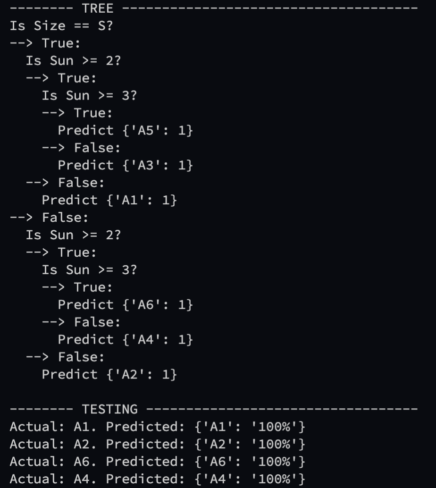
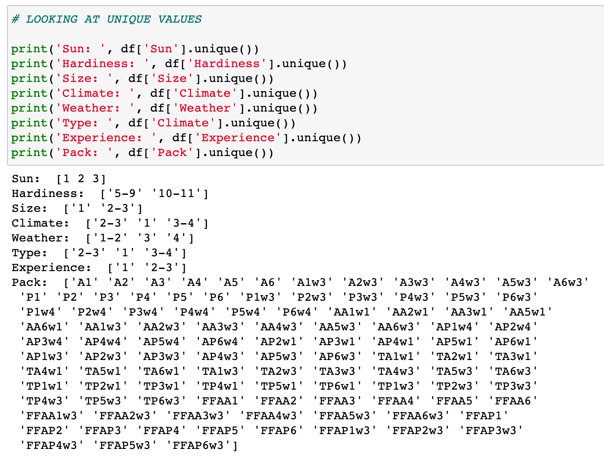

# :evergreen_tree: :evergreen_tree: :evergreen_tree: :evergreen_tree: :evergreen_tree: Decision Tree Classifier :evergreen_tree: :evergreen_tree: :evergreen_tree: :evergreen_tree: :evergreen_tree:

## Rules:
1. Dataset must have the last column be the target column. 
2. Specify this target column in tree.py's main function as "header = []" and enter the column names in the list
3. It converts any datapoint into a string because at this moment, the actual numbers are not relevant nor necessary.

## How to use: (not dockerized yet - running locally is free and this is lightweight)
1. clone repo
2. install python
3. in tree.py's main -> specify file for training dataset, testing data, and headers
4. include build_tree for the tree, print if needed. 
5. include test function for testing or just run classify on the new row

### Future Proof
This tree will work on any pretty much dataset. Add as many feature columns as needed - the gini impurity and information gain will be calculated **recursively** on all of them. 

### CART Algorithm
Calculates Gini Impurity for all viable partitions\
Based on Information Gain -> decides on order of Question

* We may use different data in the future. The Data Generation file allows us to create a large dataset by just inputting values as ranges. The generation file will then create a dataset by selecting a random value from each range as many times as you like!!! A Decision Tree is the only way to do this well

*  "if" statements are very much the wrong way to do this. They're tedious, boring, and arduous to keep up with. Not to mention very hard to change logic-wise later with more complicated situations.

Bottom Line: It's faster, easier, and simply the best solution. 

## Initial very basic testing:

## Current seedpack data (UserToPack.csv) configuration:

We have been given every possibility and they are represented by the range values. Key points:\
From the data se can see that users are placed into a range for example '2-3', we never see plants recommended as either only 2 or only for 3 - they are not unique values in the dataset. Data also never overlaps any of the ranges. Thus we can maintain this range. 
