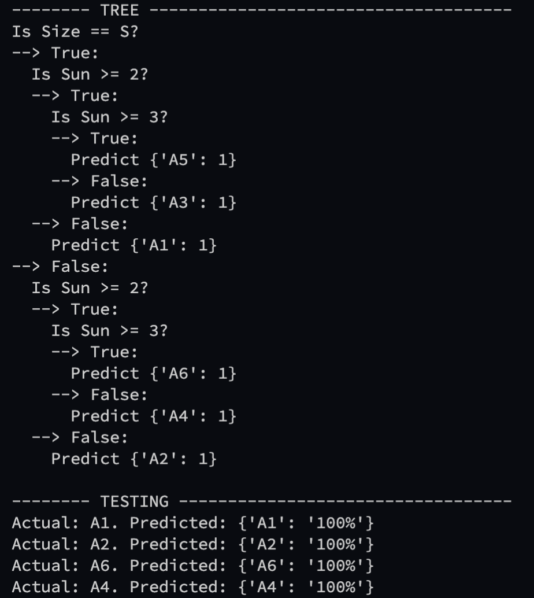

# :evergreen_tree: :evergreen_tree: :evergreen_tree: :evergreen_tree: :evergreen_tree: Decision Tree Classifier :evergreen_tree: :evergreen_tree: :evergreen_tree: :evergreen_tree: :evergreen_tree:

## Rules:
1. Dataset must have the last column be the target column. 
2. Specify this target column in tree.py's main function as "header = []" and enter the column names in the list
3. It converts any datapoint into a string because at this moment, the actual numbers are not relevant nor necessary.

## How to use: (not dockerized yet)
1. clone repo
2. install python
3. in tree.py's main -> specify file for training dataset, testing data, and headers
4. include build_tree for the tree, print if needed. 
5. include test function for testing or just run classify on the new row

### Future Proof
This tree will work on any pretty much dataset. Add as many feature columns as needed - the gini impurity and information gain will be calculated **recursively** on all of them. 

### CART Algorithm
Calculates Gini Impurity for all viable partitions\
Based on Information Gain -> decides on order of Question

### Why a ML Tree?
In case you are seeing the training dataset and wondering "why not hardcoat it?". Bc ML is more fun and easy to recycle. Technically for this task we do use some form of "intelligence" automation, an ML algorithm, to handle the recommendation process. We don't actually need to use ML - "if" statements will do just fine because we have every possibility pre-outlined right from the start. In fact, ML is almost overkill for this situation. Here's why it's the ideal method for this situation:

*  "if" statements are very much the wrong way to do this. They're tedious, boring, and arduous to keep up with. Not to mention very hard to change logic-wise later with more complicated situations.

* An overkill ML algorithm that gives us 100% accuracy is still 100% even are not predicting anything - this is a relevant and helpful way to solve the problem especially for future adjustments to data. Especially since there is no guess work and the dataset contains every possible outcome!

* A decision tree makes it very easy to understand what is going on (visually if needed!) and very easy to adjust or modify down datasets down the road!  

Bottom Line: It's faster, easier, and simply the best solution. 

## Initial very basic testing:

